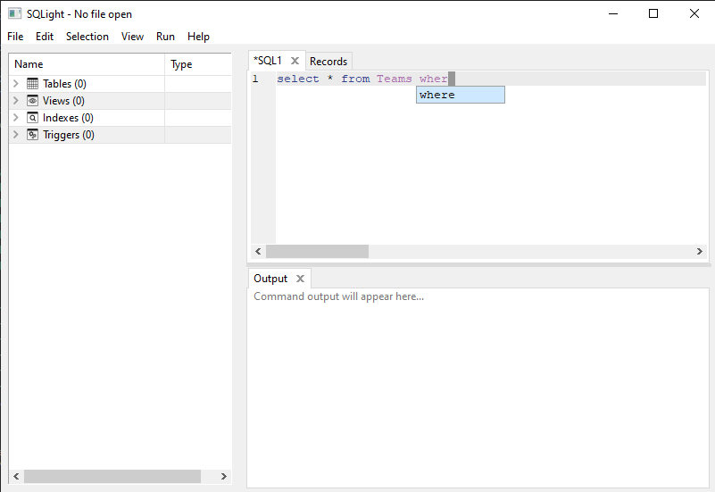

  <h1>SQLight</h1>
  
<em>Like a JetBrains IDE but for SQLite!</em>

  
  
  

...

## Table of Contents
- [Features](#features)
- [Installation](#installation)
- [Usage](#usage)
- [Contributing](#contributing)
- [License](#license)
- [Contact](#contact)

## Features
...

## Installation
Download the latest release from the [Releases Page](https://github.com/provrb/sqlight/releases) and follow the instructions provided.

## Usage
...

## Contributing
Contributions are welcome! Feel free to open issues or submit pull requests to improve functionality or fix bugs.

## License
This project is licensed under the GPL 3.0 License. See the [LICENSE](LICENSE.txt) file for details.

## Contact
For inquiries or feature requests, open an issue on GitHub.

